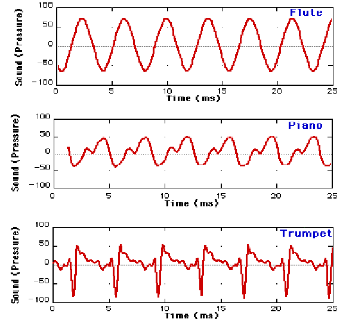

# ACUSTICA

---

# La generazione del suono dipende da almeno due elementi:
1.  Una sorgente sonora (un corpo in grado di vibrare: corde, pelli percussive, etc...)
2.  Un mezzo di propagazione (aria)

---

## La sorgente sonora può essere collegata a un `risonatore` che amplifica la vibrazione generata dalla sorgente stessa

---

## Il mezzo di propagazione possiede un certo grado di `elasticità`, che determina la velocità a cui il suono si propaga.

| materiale (21 gradi) | velocità in m/s |
| --- | --- |
| aria | 344 |
| acciaio | 5000-5900 |
| acqua | 1480 |
| calcestruzzo | 3100 |

---

| materiale (21 gradi) | velocità in m/s |
| --- | --- |
| legno di olmo | 4108 |
| legno di pino | 3313 |
| Metano | 430 |
| Piombo | 1230 |
| Vetro | 5500 |

---

## Eccitando la sorgente sonora:
1. si produce una vibrazione
2. che genera una zona di `compressione` delle molecole nel mezzo di propagazione
3. ...e una zona di `rarefazione`
4. tali zone si alternano dando vita all'`onda sonora`, o `onda di pressione sonora`

---

## L'onda sonora viaggia attraverso il mezzo di propagazione (tipicamente l'aria) e raggiunge l'orecchio, quindi il cervello, che la elabora convertendola in sensazione uditiva

---

## Le onde sonore viaggiano a una certa velocità, ma anche con una certa `forma`
1. periodica
2. aperiodica

---

# onda periodica

---

# violino

---

# onda aperiodica (rumore)

---

## Quando un'onda è periodica possiamo percepire l'`altezza` del suono, quando è aperiodica l'altezza è il più delle volte indefinibile. L'altezza è quella qualità del suono che ci permette di affermare se un suono sia acuto o grave.

---

# Parametri dell'onda sonora periodica

---

## Periodo

- Intervallo di tempo necessario all'onda per completare un `ciclo`

---

## ciclo 

Porzione di onda che va da un punto e arriva allo stesso punto dopo aver compiuto un percorso in cui l'onda tocca il suo massimo e il suo minimo. La distanza percorsa dall'onda per completare un `ciclo` si chiama `lunghezza d'onda` e si misura in centimetri o metri.

---

## frequenza

Quantità di cicli completati nell'unità di tempo (tipicamente il secondo). È inversamente proporzionale rispetto al periodo, quindi, se T è il periodo, la frequenza è uguale a 1/T, e si misura in Hertz (*Hz*)

---

## Esempio 1

Se un periodo T dura 0.001 secondi, quale sarà la sua frequenza?

---

1 / T = F
1 / 0.001 = 1000 Hz (oppure 1 KHz)

---

## Esempio 2

Se un'onda ha frequenza 440 Hz, quanto varrà T, cioè il periodo?

---

1 / F = T
1 / 440 = 0.0022727272727272726 secondi