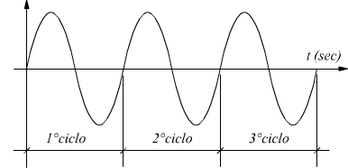
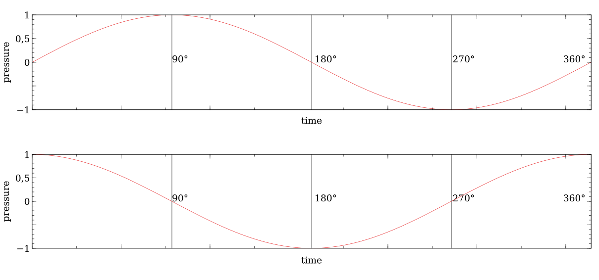
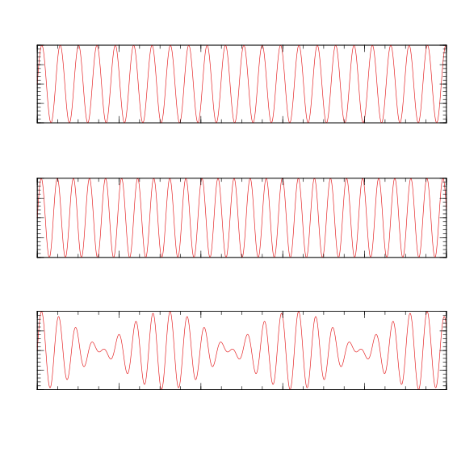

# ACUSTICA

---

# La generazione del suono dipende da almeno due elementi:
1.  Una sorgente sonora (un corpo in grado di vibrare: corde, pelli percussive, etc...)
2.  Un mezzo di propagazione (aria)

---

## La sorgente sonora può essere collegata a un `risonatore` che amplifica la vibrazione generata dalla sorgente stessa

---

## Il mezzo di propagazione possiede un certo grado di `elasticità`, che determina la velocità a cui il suono si propaga.

| materiale (21 gradi) | velocità in m/s |
| --- | --- |
| aria | 344 |
| acciaio | 5000-5900 |
| acqua | 1480 |
| calcestruzzo | 3100 |

---

| materiale (21 gradi) | velocità in m/s |
| --- | --- |
| legno di olmo | 4108 |
| legno di pino | 3313 |
| Metano | 430 |
| Piombo | 1230 |
| Vetro | 5500 |

---

## Eccitando la sorgente sonora:
1. si produce una vibrazione
2. che genera una zona di `compressione` delle molecole nel mezzo di propagazione
3. ...e una zona di `rarefazione`
4. tali zone si alternano dando vita all'`onda sonora`, o `onda di pressione sonora`

---

## L'onda sonora viaggia attraverso il mezzo di propagazione (tipicamente l'aria) e raggiunge l'orecchio, quindi il cervello, che la elabora convertendola in sensazione uditiva

---

## Le onde sonore viaggiano a una certa velocità, ma anche con una certa `forma`
1. periodica
2. aperiodica

---

# onda periodica

---

# violino

---

# onda aperiodica (rumore)

---

## Quando un'onda è periodica possiamo percepire l'`altezza` del suono, quando è aperiodica l'altezza è il più delle volte indefinibile. L'altezza è quella qualità del suono che ci permette di affermare se un suono sia acuto o grave.

---

# Parametri dell'onda sonora periodica

---

## Periodo

- Intervallo di tempo necessario all'onda per completare un `ciclo`

---

## ciclo 

Porzione di onda che va da un punto e arriva allo stesso punto dopo aver compiuto un percorso in cui l'onda tocca il suo massimo e il suo minimo. La distanza percorsa dall'onda per completare un `ciclo` si chiama `lunghezza d'onda` e si misura in centimetri o metri.

---

## frequenza

Quantità di cicli completati nell'unità di tempo (tipicamente il secondo). È inversamente proporzionale rispetto al periodo, quindi, se T è il periodo, la frequenza è uguale a 1/T, e si misura in Hertz (*Hz*)

---

## Esempio 1

Se un periodo T dura 0.001 secondi, quale sarà la sua frequenza?

---

1 / T = F
1 / 0.001 = 1000 Hz (oppure 1 KHz)

---

## Esempio 2

Se un'onda ha frequenza 440 Hz, quanto varrà T, cioè il periodo?

---

1 / F = T
1 / 440 = 0.0022727272727272726 secondi

---

# Intervallo di frequenze udibili

| < 20Hz | 20Hz - 20000Hz | > 20000Hz |
| --- | --- | --- |
| infrasuoni | range udibile | ultrasuoni |

---

## La frequenza determina la percezione dell'`altezza` di un suono

---

# Ampiezza

- Rappresenta lo `spostamento` delle particelle al passaggio dell'onda, rispetto alla propria posizione di equilibrio. 
- Oscilla fra valori positivi (zona di compressione) e valori negativi (zona di rarefazione)

---

---

## L'ampiezza determina la percezione dell'`intensità` di un suono

---

# Fase
- Indica la posizione in cui si trova il ciclo dell'onda in un determinato istante.
- Ha senso quando onde diverse vengono messe in relazione

---

---

---

# Somma di onde con stessa frequenza
- Se due sinusoidi sono `in fase`, la loro somma determina un raddoppio dell'ampiezza
- Se sono in controfase ?

---

---

# somma di onde con frequenza diversa
- Abbiamo due casi possibili:
    1.  le onde hanno frequenze vicine
    2.  le onde hanno frequenze lontane

---

# Le onde hanno frequenze vicine
- Si ha il fenomeno dei `battimenti` quando la differenza fra le due frequenze è minore di 20 Hz
- Si percepisce un'onda risultante con un'oscillazione regolare dell'ampiezza

---

---

# Valori dell'onda risultante
- La frequenza dell'onda risultante è la media aritmetica fra le due frequenze
- La frequenza di oscillazione (detta `frequenza di battimento`) è pari alla differenza fra le frequenze d'origine

---

# Esempio
- Se sommiamo le seguenti onde: 440Hz e 444Hz, cosa otterremo?

---

# Forma d'onda
- Rappresentazione grafica dell'ampiezza del suono in funzione del tempo
- L'onda più semplice è la sinusoide
- Generalmente le forme d'onda sono il risultato di somme di onde semplici che danno vita a onde complesse

---

# Ampiezza istantanea, ampiezza di picco, ampiezza assoluta
- l'ampiezza istantanea rappresenta il valore d'ampiezza in un dato punto
- l'ampiezza di picco indica l'ampiezza massima
- l'ampiezza assoluta indica la differenza fra l'ampiezza massima e l'ampiezza minima

---

---

# Timbro
- Le forme d'onda complesse danno origine al timbro, che ci permette di distinguere un suono da un altro, a parità di frequenza e ampiezza.
- Gli strumenti sono caratterizzati da forme d'onda specifiche, quindi da timbri caratteristici

---

# Timbro (2)
- Non possiamo `vedere` il timbro dalla forma d'onda, quindi abbiamo bisogno di altri strumenti di analisi

---

# Spettrogramma
- Permette di analizzare (e visualizzare) lo spettro di un suono, cioè le sue componenti `frequenziali`

---

---

# Inviluppo
- Costituisce il profilo d'ampiezza di un suono da quando inizia a quando termina.
- Caratterizzato da 4 fasi fasi chiamate `transitori`:
    1. Attacco (`attack`)
    2. Decadimento (`decay`)
    3. Sostegno (`sustain`)
    4. Rilascio (`release`)

---

---

# Attack
Descrive il periodo di tempo in cui il suono nasce e raggiunge il suo culmine d'ampiezza

---

# Decay
Descrive il periodo che seguen l'attacco, in cui l'ampiezza decade fino a raggiungere il livello del sostegno

---

# Sustain
L'ampiezza si mantiene generalmente stabile

---

# Rilascio
Il suono decade fino a scomparire

---

---

# Inviluppo (2)
Non tutti i suoni possiedono i 4 transitori. In linea di massima, ogni suono nasce e muore, quindi ha attacco e rilascio, ma non necessariamente possiede i transitori di decadimento e sostegno.

---

# Inviluppo (3)
- Gli strumenti a percussione hanno attacco e rilascio
- flauto e violino hanno tutti e 4 i transitori